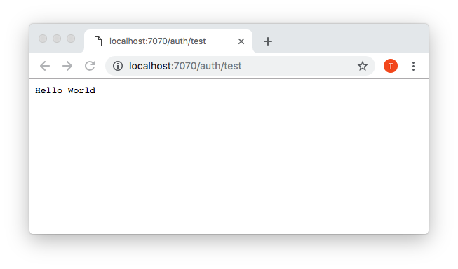
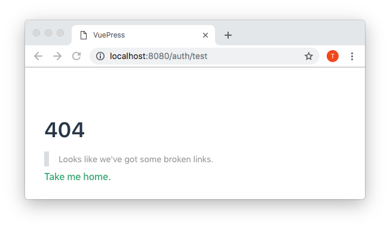

## Replicating the issue

##### VuePress issue:
[config.devServer.proxy doesn't proxy, shows NotFound.vue](https://github.com/vuejs/vuepress/issues/1550)

```
yarn install
```

Using two terminal windows, run the below at the same time:
```
yarn server:start
```
> This will start an express server on port 7070 with all routes returning 'Hello World'

```
yarn docs:dev
```
> This will start a basic Vuepress app running on port 8080 (assuming not already in use)

## Verification of issue

### Verify server is working correctly ✔

- Navigate to http://localhost:7070/auth/test

#### Expected Result
Should show `Hello World`

#### Actual Result
Shows `Hello World` ✔



### Verify proxy is working correctly ✘

 - Navigate to http://localhost:8080/auth/test

#### Expected Result
Should proxy `:7070/auth/*` through port `8080`, therefore showing `Hello World`

#### Actual Result
Shows 404 page, from default `NotFound.vue` component and using `vue-router` ✘


